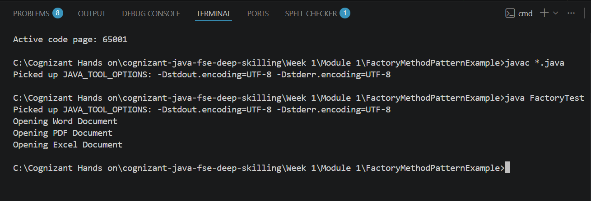

# Factory Method Pattern Example

## Objective

Implement the Factory Method Design Pattern to create different document objects using factory classes.

## Files

* Document.java
* DocumentFactory.java
* ExcelDocument.java
* ExcelFactory.java
* PdfDocument.java
* PdfFactory.java
* WordDocument.java
* WordFactory.java
* FactoryTest.java

## Output

## Author

**Shankaragouda Patil**